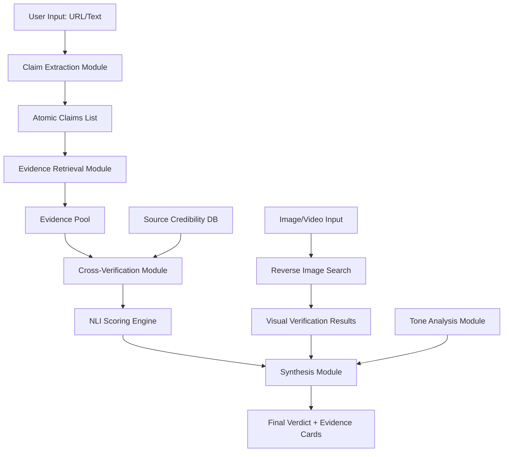
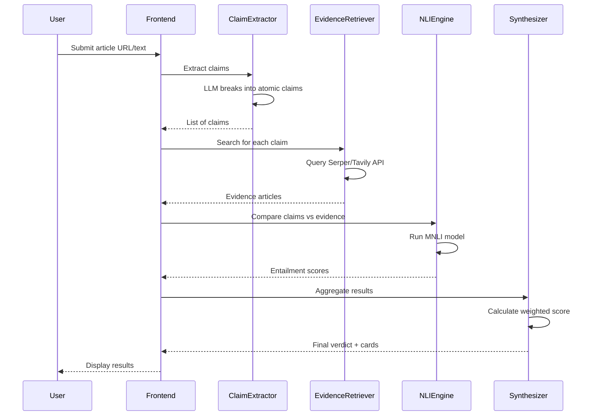

# Design Document: Fake News Detection System

## Overview

A multi-source verification system that analyzes news articles or text claims to determine their veracity through explainable AI. The system extracts atomic claims, retrieves live evidence from trusted sources, performs cross-verification using Natural Language Inference, and synthesizes results into an actionable verdict with supporting evidence. Built entirely with free-tier tools for hackathon deployment, it prioritizes transparency and user education over black-box classification.

## Architecture



## Main Processing Workflow




## Components and Interfaces

### Component 1: Claim Extraction Module

**Purpose**: Decomposes input article into atomic, verifiable claims using LLM

**Interface**:
```pascal
INTERFACE ClaimExtractor
  PROCEDURE extractClaims(articleText: String): List<Claim>
  PROCEDURE parseArticleFromURL(url: String): String
END INTERFACE

STRUCTURE Claim
  id: UUID
  text: String
  context: String
  importance: Float
END STRUCTURE
```

**Responsibilities**:
- Parse article text from URL or direct input
- Use LLM (OpenAI/Groq) to identify factual claims
- Filter out opinions and subjective statements
- Rank claims by importance for verification priority

### Component 2: Evidence Retrieval Module

**Purpose**: Searches live web sources for supporting/contradicting evidence

**Interface**:
```pascal
INTERFACE EvidenceRetriever
  PROCEDURE searchEvidence(claim: Claim): List<Evidence>
  PROCEDURE filterTrustedSources(results: List<SearchResult>): List<Evidence>
  PROCEDURE rankByRelevance(evidence: List<Evidence>): List<Evidence>
END INTERFACE

STRUCTURE Evidence
  id: UUID
  sourceURL: String
  sourceDomain: String
  snippet: String
  publishDate: DateTime
  credibilityScore: Float
  relevanceScore: Float
END STRUCTURE
```

**Responsibilities**:
- Query Serper.dev or Tavily API with claim text
- Filter results to trusted news domains
- Extract relevant snippets from search results
- Assign credibility scores based on source reputation

### Component 3: Cross-Verification Module (NLI Engine)

**Purpose**: Compares claims against evidence using Natural Language Inference

**Interface**:
```pascal
INTERFACE NLIEngine
  PROCEDURE verifyClaimAgainstEvidence(claim: Claim, evidence: Evidence): NLIResult
  PROCEDURE aggregateNLIScores(results: List<NLIResult>): VerificationScore
END INTERFACE

STRUCTURE NLIResult
  claimID: UUID
  evidenceID: UUID
  entailmentScore: Float
  contradictionScore: Float
  neutralScore: Float
  label: Enum(SUPPORTS, REFUTES, NEUTRAL)
END STRUCTURE

STRUCTURE VerificationScore
  claimID: UUID
  supportCount: Integer
  refuteCount: Integer
  neutralCount: Integer
  confidenceScore: Float
  verdict: Enum(TRUE, FALSE, MISLEADING, UNVERIFIED)
END STRUCTURE
```

**Responsibilities**:
- Load HuggingFace MNLI model
- Run inference for each claim-evidence pair
- Classify relationship as entailment/contradiction/neutral
- Aggregate scores across multiple evidence sources

### Component 4: Synthesis Module

**Purpose**: Combines verification results into final verdict with explanations

**Interface**:
```pascal
INTERFACE Synthesizer
  PROCEDURE generateVerdict(scores: List<VerificationScore>): FinalVerdict
  PROCEDURE createEvidenceCards(claim: Claim, evidence: List<Evidence>, nli: List<NLIResult>): List<EvidenceCard>
  PROCEDURE generateExplanation(verdict: FinalVerdict): String
END INTERFACE

STRUCTURE FinalVerdict
  overallVerdict: Enum(LIKELY_TRUE, LIKELY_FALSE, MISLEADING, UNVERIFIED)
  confidenceScore: Float
  factualAccuracyScore: Float
  emotionalManipulationScore: Float
  claimBreakdown: List<ClaimVerdict>
  evidenceCards: List<EvidenceCard>
  explanation: String
END STRUCTURE

STRUCTURE ClaimVerdict
  claim: Claim
  verdict: Enum(TRUE, FALSE, MISLEADING, UNVERIFIED)
  confidence: Float
  supportingEvidence: List<Evidence>
  contradictingEvidence: List<Evidence>
END STRUCTURE

STRUCTURE EvidenceCard
  claim: String
  evidenceSnippet: String
  sourceURL: String
  sourceName: String
  relationship: Enum(SUPPORTS, REFUTES, NEUTRAL)
  highlightedDiscrepancies: List<String>
END STRUCTURE
```

**Responsibilities**:
- Calculate weighted final score (0.6×Evidence + 0.2×Credibility + 0.2×Style)
- Generate side-by-side evidence cards with highlighted discrepancies
- Separate factual accuracy from emotional manipulation
- Create simple language explanation for users

**Implementation Note - Verdict Determination Logic**:
The overall verdict is determined using strict thresholds to ensure accurate classification:
- **LIKELY_FALSE**: Assigned if >40% of claims are FALSE OR final score <40
- **MISLEADING**: Assigned if >30% of claims are MISLEADING OR score is 40-65
- **LIKELY_TRUE**: Assigned ONLY if >60% of claims are TRUE AND score ≥65
- **UNVERIFIED**: Default for unclear cases
- **Priority Order**: FALSE > MISLEADING > TRUE > UNVERIFIED (prevents false positives)

This strict logic prevents the system from incorrectly marking false news as true, which was a critical bug in earlier implementations. The thresholds were calibrated to prioritize precision over recall for FALSE detection.

### Component 5: Tone Analysis Module

**Purpose**: Detects emotional manipulation separate from factual content

**Interface**:
```pascal
INTERFACE ToneAnalyzer
  PROCEDURE analyzeTone(text: String): ToneScore
  PROCEDURE detectManipulativePhrases(text: String): List<String>
END INTERFACE

STRUCTURE ToneScore
  emotionalIntensity: Float
  sensationalismScore: Float
  manipulativePhrases: List<String>
  objectivityScore: Float
END STRUCTURE
```

**Responsibilities**:
- Analyze writing style for emotional language
- Detect sensationalist phrases and clickbait patterns
- Score objectivity vs manipulation
- Provide separate score from factual accuracy

### Component 6: Visual Verification Module

**Purpose**: Verifies images and videos through reverse search

**Interface**:
```pascal
INTERFACE VisualVerifier
  PROCEDURE reverseImageSearch(imageURL: String): List<ImageMatch>
  PROCEDURE detectManipulation(imageURL: String): ManipulationReport
END INTERFACE

STRUCTURE ImageMatch
  originalURL: String
  firstSeenDate: DateTime
  context: String
  similarity: Float
END STRUCTURE

STRUCTURE ManipulationReport
  isManipulated: Boolean
  confidence: Float
  manipulationType: Enum(NONE, EDITED, DEEPFAKE, OUT_OF_CONTEXT)
  details: String
END STRUCTURE
```

**Responsibilities**:
- Perform reverse image search via free APIs
- Detect if image is out of context or manipulated
- Find original source and publication date
- Flag potential deepfakes or edits


## Data Models

### ArticleInput

```pascal
STRUCTURE ArticleInput
  inputType: Enum(URL, TEXT, IMAGE)
  content: String
  metadata: Map<String, String>
END STRUCTURE
```

**Validation Rules**:
- inputType must be one of URL, TEXT, or IMAGE
- content must be non-empty string
- If inputType is URL, content must be valid HTTP/HTTPS URL
- If inputType is IMAGE, content must be valid image URL or base64 data

### SourceCredibility

```pascal
STRUCTURE SourceCredibility
  domain: String
  credibilityScore: Float
  category: Enum(TRUSTED, MAINSTREAM, QUESTIONABLE, UNRELIABLE)
  lastUpdated: DateTime
END STRUCTURE
```

**Validation Rules**:
- domain must be valid domain name
- credibilityScore must be between 0.0 and 1.0
- category must map to credibilityScore ranges:
  - TRUSTED: 0.8-1.0
  - MAINSTREAM: 0.5-0.79
  - QUESTIONABLE: 0.3-0.49
  - UNRELIABLE: 0.0-0.29

### ChainOfCustody

```pascal
STRUCTURE ChainOfCustody
  originalSource: String
  firstPublished: DateTime
  propagationPath: List<PropagationNode>
  viralityScore: Float
END STRUCTURE

STRUCTURE PropagationNode
  source: String
  timestamp: DateTime
  modifications: List<String>
END STRUCTURE
```

**Validation Rules**:
- originalSource must be non-empty
- firstPublished must be valid datetime
- propagationPath must be chronologically ordered
- viralityScore must be between 0.0 and 1.0

## Algorithmic Pseudocode

### Main Verification Algorithm

```pascal
ALGORITHM verifyArticle(input)
INPUT: input of type ArticleInput
OUTPUT: verdict of type FinalVerdict

BEGIN
  ASSERT input.content IS NOT NULL AND input.content IS NOT EMPTY
  
  // Step 1: Extract atomic claims
  articleText ← parseContent(input)
  claims ← claimExtractor.extractClaims(articleText)
  ASSERT claims.length > 0
  
  // Step 2: Retrieve evidence for each claim
  allEvidence ← EMPTY_LIST
  FOR each claim IN claims DO
    ASSERT claim.text IS NOT EMPTY
    
    evidence ← evidenceRetriever.searchEvidence(claim)
    filteredEvidence ← evidenceRetriever.filterTrustedSources(evidence)
    allEvidence.append({claim: claim, evidence: filteredEvidence})
  END FOR
  
  // Step 3: Cross-verify claims against evidence
  verificationScores ← EMPTY_LIST
  FOR each pair IN allEvidence DO
    claimScore ← INITIALIZE_SCORE()
    
    FOR each evidenceItem IN pair.evidence DO
      nliResult ← nliEngine.verifyClaimAgainstEvidence(pair.claim, evidenceItem)
      claimScore ← updateScore(claimScore, nliResult, evidenceItem.credibilityScore)
    END FOR
    
    verificationScores.append(claimScore)
  END FOR
  
  // Step 4: Analyze tone separately
  toneScore ← toneAnalyzer.analyzeTone(articleText)
  
  // Step 5: Synthesize final verdict
  verdict ← synthesizer.generateVerdict(verificationScores)
  verdict.emotionalManipulationScore ← toneScore.sensationalismScore
  verdict.evidenceCards ← synthesizer.createEvidenceCards(claims, allEvidence, verificationScores)
  verdict.explanation ← synthesizer.generateExplanation(verdict)
  
  ASSERT verdict.confidenceScore >= 0 AND verdict.confidenceScore <= 100
  ASSERT verdict.overallVerdict IN {LIKELY_TRUE, LIKELY_FALSE, MISLEADING, UNVERIFIED}
  
  RETURN verdict
END
```

**Preconditions:**
- input is non-null and well-formed ArticleInput
- input.content is non-empty string
- All required API services (LLM, search, NLI) are accessible
- Source credibility database is loaded

**Postconditions:**
- Returns valid FinalVerdict object
- verdict.confidenceScore is between 0 and 100
- verdict.overallVerdict is one of the four valid enum values
- verdict.claimBreakdown contains entry for each extracted claim
- verdict.evidenceCards contains at least one card per verified claim

**Loop Invariants:**
- In evidence retrieval loop: All processed claims have non-empty evidence lists
- In verification loop: All processed claim-evidence pairs have valid NLI scores
- All intermediate scores remain within valid ranges [0.0, 1.0]

### Claim Extraction Algorithm

```pascal
ALGORITHM extractClaims(articleText)
INPUT: articleText of type String
OUTPUT: claims of type List<Claim>

BEGIN
  ASSERT articleText IS NOT NULL AND articleText.length > 0
  
  // Step 1: Preprocess text
  cleanedText ← removeAds(articleText)
  cleanedText ← normalizeWhitespace(cleanedText)
  
  // Step 2: Use LLM to extract claims
  prompt ← buildClaimExtractionPrompt(cleanedText)
  llmResponse ← callLLM(prompt)
  rawClaims ← parseLLMResponse(llmResponse)
  
  // Step 3: Filter and rank claims
  claims ← EMPTY_LIST
  FOR each rawClaim IN rawClaims DO
    IF isFactualClaim(rawClaim) AND NOT isOpinion(rawClaim) THEN
      claim ← CREATE_CLAIM(rawClaim)
      claim.importance ← calculateImportance(rawClaim, cleanedText)
      claims.append(claim)
    END IF
  END FOR
  
  // Step 4: Sort by importance
  claims ← sortByImportance(claims)
  
  ASSERT claims.length > 0
  ASSERT ALL claim IN claims: claim.importance >= 0 AND claim.importance <= 1
  
  RETURN claims
END
```

**Preconditions:**
- articleText is non-null and non-empty
- LLM service is available and responsive
- Text length is within LLM token limits

**Postconditions:**
- Returns non-empty list of Claim objects
- All claims are factual statements (not opinions)
- Claims are sorted by importance (descending)
- Each claim has importance score between 0 and 1
- Each claim has unique ID

**Loop Invariants:**
- All processed claims are factual (not opinions)
- All claim importance scores remain in valid range [0, 1]


### Evidence Retrieval Algorithm

```pascal
ALGORITHM searchEvidence(claim)
INPUT: claim of type Claim
OUTPUT: evidence of type List<Evidence>

BEGIN
  ASSERT claim IS NOT NULL AND claim.text IS NOT EMPTY
  
  // Step 1: Build search query
  searchQuery ← optimizeQueryForSearch(claim.text)
  
  // Step 2: Query search API
  searchResults ← callSearchAPI(searchQuery)
  ASSERT searchResults IS NOT NULL
  
  // Step 3: Filter trusted sources
  trustedResults ← EMPTY_LIST
  FOR each result IN searchResults DO
    domain ← extractDomain(result.url)
    credibility ← lookupSourceCredibility(domain)
    
    IF credibility.score >= MINIMUM_CREDIBILITY_THRESHOLD THEN
      evidence ← CREATE_EVIDENCE(result)
      evidence.credibilityScore ← credibility.score
      evidence.relevanceScore ← calculateRelevance(claim.text, result.snippet)
      trustedResults.append(evidence)
    END IF
  END FOR
  
  // Step 4: Rank by combined score
  FOR each evidence IN trustedResults DO
    evidence.combinedScore ← 0.7 * evidence.relevanceScore + 0.3 * evidence.credibilityScore
  END FOR
  
  trustedResults ← sortByCombinedScore(trustedResults)
  topEvidence ← trustedResults[0:MAX_EVIDENCE_PER_CLAIM]
  
  ASSERT ALL e IN topEvidence: e.credibilityScore >= MINIMUM_CREDIBILITY_THRESHOLD
  
  RETURN topEvidence
END
```

**Preconditions:**
- claim is non-null with non-empty text
- Search API is accessible
- Source credibility database is loaded
- MINIMUM_CREDIBILITY_THRESHOLD is defined (e.g., 0.3)
- MAX_EVIDENCE_PER_CLAIM is defined (e.g., 5)

**Postconditions:**
- Returns list of Evidence objects (may be empty if no trusted sources found)
- All returned evidence has credibilityScore >= MINIMUM_CREDIBILITY_THRESHOLD
- Evidence is sorted by combined score (descending)
- List length does not exceed MAX_EVIDENCE_PER_CLAIM
- Each evidence item has valid relevanceScore and credibilityScore in [0, 1]

**Loop Invariants:**
- All evidence in trustedResults has credibilityScore >= threshold
- All scores remain in valid range [0, 1]

### NLI Verification Algorithm

```pascal
ALGORITHM verifyClaimAgainstEvidence(claim, evidence)
INPUT: claim of type Claim, evidence of type Evidence
OUTPUT: result of type NLIResult

BEGIN
  ASSERT claim IS NOT NULL AND evidence IS NOT NULL
  ASSERT claim.text IS NOT EMPTY AND evidence.snippet IS NOT EMPTY
  
  // Step 1: Prepare input for NLI model
  premise ← evidence.snippet
  hypothesis ← claim.text
  
  // Step 2: Run NLI model inference
  modelInput ← formatForNLI(premise, hypothesis)
  modelOutput ← nliModel.predict(modelInput)
  
  // Step 3: Extract scores
  result ← CREATE_NLI_RESULT()
  result.claimID ← claim.id
  result.evidenceID ← evidence.id
  result.entailmentScore ← modelOutput.scores[ENTAILMENT]
  result.contradictionScore ← modelOutput.scores[CONTRADICTION]
  result.neutralScore ← modelOutput.scores[NEUTRAL]
  
  // Step 4: Determine label
  maxScore ← max(result.entailmentScore, result.contradictionScore, result.neutralScore)
  IF maxScore = result.entailmentScore THEN
    result.label ← SUPPORTS
  ELSE IF maxScore = result.contradictionScore THEN
    result.label ← REFUTES
  ELSE
    result.label ← NEUTRAL
  END IF
  
  ASSERT result.entailmentScore + result.contradictionScore + result.neutralScore ≈ 1.0
  ASSERT result.label IN {SUPPORTS, REFUTES, NEUTRAL}
  
  RETURN result
END
```

**Preconditions:**
- claim and evidence are non-null
- claim.text and evidence.snippet are non-empty
- NLI model is loaded and ready
- Text lengths are within model's token limits

**Postconditions:**
- Returns valid NLIResult object
- Sum of three scores approximately equals 1.0 (within floating point tolerance)
- label matches the highest score
- All scores are non-negative

**Loop Invariants:** N/A (no loops in this algorithm)

### Score Aggregation Algorithm

```pascal
ALGORITHM aggregateNLIScores(results)
INPUT: results of type List<NLIResult>
OUTPUT: score of type VerificationScore

BEGIN
  ASSERT results IS NOT NULL AND results.length > 0
  ASSERT ALL r IN results: r.claimID = results[0].claimID
  
  score ← CREATE_VERIFICATION_SCORE()
  score.claimID ← results[0].claimID
  score.supportCount ← 0
  score.refuteCount ← 0
  score.neutralCount ← 0
  
  totalWeight ← 0.0
  weightedSupport ← 0.0
  weightedRefute ← 0.0
  
  // Step 1: Count and weight evidence
  FOR each result IN results DO
    weight ← getEvidenceWeight(result.evidenceID)
    totalWeight ← totalWeight + weight
    
    IF result.label = SUPPORTS THEN
      score.supportCount ← score.supportCount + 1
      weightedSupport ← weightedSupport + (result.entailmentScore * weight)
    ELSE IF result.label = REFUTES THEN
      score.refuteCount ← score.refuteCount + 1
      weightedRefute ← weightedRefute + (result.contradictionScore * weight)
    ELSE
      score.neutralCount ← score.neutralCount + 1
    END IF
  END FOR
  
  // Step 2: Calculate confidence and verdict
  IF totalWeight > 0 THEN
    supportRatio ← weightedSupport / totalWeight
    refuteRatio ← weightedRefute / totalWeight
    
    IF supportRatio > 0.6 AND refuteRatio < 0.2 THEN
      score.verdict ← TRUE
      score.confidenceScore ← supportRatio * 100
    ELSE IF refuteRatio > 0.6 AND supportRatio < 0.2 THEN
      score.verdict ← FALSE
      score.confidenceScore ← refuteRatio * 100
    ELSE IF supportRatio > 0.3 AND refuteRatio > 0.3 THEN
      score.verdict ← MISLEADING
      score.confidenceScore ← 50.0
    ELSE
      score.verdict ← UNVERIFIED
      score.confidenceScore ← 30.0
    END IF
  ELSE
    score.verdict ← UNVERIFIED
    score.confidenceScore ← 0.0
  END IF
  
  ASSERT score.confidenceScore >= 0 AND score.confidenceScore <= 100
  ASSERT score.verdict IN {TRUE, FALSE, MISLEADING, UNVERIFIED}
  
  RETURN score
END
```

**Preconditions:**
- results is non-null and non-empty
- All results have the same claimID
- All results have valid label values
- Evidence weights are available for all evidenceIDs

**Postconditions:**
- Returns valid VerificationScore object
- confidenceScore is between 0 and 100
- verdict is one of four valid enum values
- supportCount + refuteCount + neutralCount equals results.length
- Verdict matches the dominant evidence pattern

**Loop Invariants:**
- totalWeight is non-negative and monotonically increasing
- supportCount + refuteCount + neutralCount equals number of processed results
- All weighted scores remain non-negative


### Weighted Final Score Calculation

```pascal
ALGORITHM calculateFinalScore(verificationScores, toneScore, sourceCredibility)
INPUT: verificationScores of type List<VerificationScore>,
       toneScore of type ToneScore,
       sourceCredibility of type Float
OUTPUT: finalScore of type Float

BEGIN
  ASSERT verificationScores.length > 0
  ASSERT toneScore IS NOT NULL
  ASSERT sourceCredibility >= 0 AND sourceCredibility <= 1
  
  // Step 1: Calculate evidence match score
  totalClaims ← verificationScores.length
  trueCount ← COUNT(v IN verificationScores WHERE v.verdict = TRUE)
  falseCount ← COUNT(v IN verificationScores WHERE v.verdict = FALSE)
  misleadingCount ← COUNT(v IN verificationScores WHERE v.verdict = MISLEADING)
  
  evidenceMatchScore ← (trueCount / totalClaims) * 100
  
  // Step 2: Calculate writing style score
  writingStyleScore ← (1.0 - toneScore.sensationalismScore) * 100
  
  // Step 3: Apply weighted formula
  finalScore ← (0.6 * evidenceMatchScore) + 
               (0.2 * sourceCredibility * 100) + 
               (0.2 * writingStyleScore)
  
  // Step 4: Apply penalties
  IF misleadingCount > 0 THEN
    penalty ← (misleadingCount / totalClaims) * 20
    finalScore ← finalScore - penalty
  END IF
  
  IF falseCount > totalClaims / 2 THEN
    finalScore ← finalScore * 0.5
  END IF
  
  // Step 5: Clamp to valid range
  finalScore ← max(0, min(100, finalScore))
  
  ASSERT finalScore >= 0 AND finalScore <= 100
  
  RETURN finalScore
END
```

**Preconditions:**
- verificationScores is non-empty list
- toneScore is valid ToneScore object
- sourceCredibility is in range [0, 1]
- All verificationScores have valid verdict values

**Postconditions:**
- Returns score between 0 and 100 (inclusive)
- Score reflects weighted combination of evidence, credibility, and style
- Penalties are applied for misleading or false claims
- Final score is clamped to valid range

**Loop Invariants:** N/A (uses aggregate functions, not explicit loops)

## Key Functions with Formal Specifications

### Function 1: parseContent()

```pascal
FUNCTION parseContent(input: ArticleInput): String
```

**Preconditions:**
- input is non-null ArticleInput object
- input.content is non-empty string
- If input.inputType is URL, content must be valid accessible URL

**Postconditions:**
- Returns non-empty string containing article text
- HTML tags are stripped if input was URL
- Text is normalized (whitespace, encoding)
- Returns empty string only if parsing fails (error case)

**Loop Invariants:** N/A

### Function 2: callLLM()

```pascal
FUNCTION callLLM(prompt: String): String
```

**Preconditions:**
- prompt is non-null and non-empty
- prompt length is within LLM token limits
- LLM API key is configured
- LLM service is accessible

**Postconditions:**
- Returns non-empty string with LLM response
- Response format matches expected structure
- If API call fails, returns error indicator or throws exception
- No side effects on input prompt

**Loop Invariants:** N/A

### Function 3: callSearchAPI()

```pascal
FUNCTION callSearchAPI(query: String): List<SearchResult>
```

**Preconditions:**
- query is non-null and non-empty
- Search API key is configured
- Search service is accessible
- Query length is within API limits

**Postconditions:**
- Returns list of SearchResult objects (may be empty)
- Each result has valid URL and snippet
- Results are ordered by relevance (API default)
- If API call fails, returns empty list or throws exception

**Loop Invariants:** N/A

### Function 4: lookupSourceCredibility()

```pascal
FUNCTION lookupSourceCredibility(domain: String): SourceCredibility
```

**Preconditions:**
- domain is non-null and valid domain name format
- Source credibility database is loaded

**Postconditions:**
- Returns SourceCredibility object for domain
- If domain not in database, returns default credibility (e.g., 0.5)
- credibilityScore is in range [0, 1]
- category matches score range

**Loop Invariants:** N/A

### Function 5: formatForNLI()

```pascal
FUNCTION formatForNLI(premise: String, hypothesis: String): ModelInput
```

**Preconditions:**
- premise and hypothesis are non-null and non-empty
- Combined length is within model token limits

**Postconditions:**
- Returns ModelInput object formatted for NLI model
- Input contains both premise and hypothesis
- Format matches model's expected input structure
- No modifications to original strings beyond formatting

**Loop Invariants:** N/A

## Example Usage

```pascal
// Example 1: Basic article verification
SEQUENCE
  input ← CREATE_ARTICLE_INPUT(URL, "https://example.com/news/article")
  verdict ← verifyArticle(input)
  
  DISPLAY "Verdict: " + verdict.overallVerdict
  DISPLAY "Confidence: " + verdict.confidenceScore + "%"
  DISPLAY "Factual Accuracy: " + verdict.factualAccuracyScore
  DISPLAY "Emotional Manipulation: " + verdict.emotionalManipulationScore
  
  FOR each card IN verdict.evidenceCards DO
    DISPLAY "Claim: " + card.claim
    DISPLAY "Evidence: " + card.evidenceSnippet
    DISPLAY "Source: " + card.sourceName
    DISPLAY "Relationship: " + card.relationship
  END FOR
END SEQUENCE

// Example 2: Text-based verification
SEQUENCE
  articleText ← "Breaking: Scientists discover cure for all diseases..."
  input ← CREATE_ARTICLE_INPUT(TEXT, articleText)
  verdict ← verifyArticle(input)
  
  IF verdict.overallVerdict = LIKELY_FALSE THEN
    DISPLAY "Warning: This claim appears to be false"
    DISPLAY "Explanation: " + verdict.explanation
  END IF
END SEQUENCE

// Example 3: Claim-by-claim analysis
SEQUENCE
  input ← CREATE_ARTICLE_INPUT(URL, "https://example.com/article")
  verdict ← verifyArticle(input)
  
  FOR each claimVerdict IN verdict.claimBreakdown DO
    DISPLAY "Claim: " + claimVerdict.claim.text
    DISPLAY "Status: " + claimVerdict.verdict
    DISPLAY "Confidence: " + claimVerdict.confidence + "%"
    
    IF claimVerdict.verdict = FALSE THEN
      DISPLAY "Contradicting evidence:"
      FOR each evidence IN claimVerdict.contradictingEvidence DO
        DISPLAY "  - " + evidence.snippet + " (" + evidence.sourceDomain + ")"
      END FOR
    END IF
  END FOR
END SEQUENCE

// Example 4: Image verification
SEQUENCE
  imageURL ← "https://example.com/suspicious-image.jpg"
  input ← CREATE_ARTICLE_INPUT(IMAGE, imageURL)
  
  matches ← visualVerifier.reverseImageSearch(imageURL)
  manipulation ← visualVerifier.detectManipulation(imageURL)
  
  IF matches.length > 0 THEN
    original ← matches[0]
    DISPLAY "Original image found from: " + original.firstSeenDate
    DISPLAY "Original context: " + original.context
  END IF
  
  IF manipulation.isManipulated THEN
    DISPLAY "Warning: Image may be manipulated"
    DISPLAY "Type: " + manipulation.manipulationType
    DISPLAY "Confidence: " + manipulation.confidence
  END IF
END SEQUENCE
```


## Correctness Properties

### Universal Quantification Properties

**Property 1: Score Validity**
```pascal
∀ verdict ∈ FinalVerdict:
  (verdict.confidenceScore >= 0 ∧ verdict.confidenceScore <= 100) ∧
  (verdict.factualAccuracyScore >= 0 ∧ verdict.factualAccuracyScore <= 100) ∧
  (verdict.emotionalManipulationScore >= 0 ∧ verdict.emotionalManipulationScore <= 100)
```

**Property 2: Verdict Consistency**
```pascal
∀ verdict ∈ FinalVerdict:
  (verdict.overallVerdict = LIKELY_TRUE ⟹ verdict.confidenceScore > 60) ∧
  (verdict.overallVerdict = LIKELY_FALSE ⟹ verdict.confidenceScore > 60) ∧
  (verdict.overallVerdict = UNVERIFIED ⟹ verdict.confidenceScore < 50)
```

**Property 3: Evidence Card Completeness**
```pascal
∀ verdict ∈ FinalVerdict, ∀ claim ∈ verdict.claimBreakdown:
  ∃ card ∈ verdict.evidenceCards: card.claim = claim.claim.text
```

**Property 4: NLI Score Normalization**
```pascal
∀ result ∈ NLIResult:
  |result.entailmentScore + result.contradictionScore + result.neutralScore - 1.0| < ε
  WHERE ε = 0.01
```

**Property 5: Claim Extraction Non-Empty**
```pascal
∀ articleText ∈ String WHERE articleText.length > 100:
  extractClaims(articleText).length > 0
```

**Property 6: Evidence Credibility Threshold**
```pascal
∀ evidence ∈ Evidence, ∀ claim ∈ Claim:
  (evidence ∈ searchEvidence(claim)) ⟹ 
  (evidence.credibilityScore >= MINIMUM_CREDIBILITY_THRESHOLD)
```

**Property 7: Verification Score Aggregation**
```pascal
∀ results ∈ List<NLIResult>, score = aggregateNLIScores(results):
  score.supportCount + score.refuteCount + score.neutralCount = results.length
```

**Property 8: Weighted Score Bounds**
```pascal
∀ scores ∈ List<VerificationScore>, tone ∈ ToneScore, cred ∈ Float:
  0 <= calculateFinalScore(scores, tone, cred) <= 100
```

**Property 9: Claim Importance Ordering**
```pascal
∀ claims = extractClaims(text):
  ∀ i, j WHERE 0 <= i < j < claims.length:
    claims[i].importance >= claims[j].importance
```

**Property 10: Evidence Relevance**
```pascal
∀ claim ∈ Claim, evidence ∈ searchEvidence(claim):
  evidence.relevanceScore > 0 ∧ evidence.relevanceScore <= 1
```

## Error Handling

### Error Scenario 1: LLM API Failure

**Condition**: LLM service is unavailable or returns error during claim extraction
**Response**: 
- Catch API exception
- Log error with timestamp and request details
- Fall back to rule-based claim extraction (sentence splitting + keyword filtering)
- Set confidence penalty flag in metadata

**Recovery**: 
- Retry with exponential backoff (3 attempts)
- If all retries fail, use fallback method
- Display warning to user about reduced accuracy

### Error Scenario 2: Search API Rate Limit

**Condition**: Search API returns 429 Too Many Requests
**Response**:
- Catch rate limit exception
- Queue remaining claims for delayed processing
- Process already-retrieved evidence
- Return partial results with UNVERIFIED status for pending claims

**Recovery**:
- Wait for rate limit reset (check Retry-After header)
- Resume processing queued claims
- Update verdict with complete results
- Notify user of delayed processing

### Error Scenario 3: Invalid URL Input

**Condition**: User provides malformed URL or inaccessible webpage
**Response**:
- Validate URL format before processing
- Attempt to fetch with timeout (10 seconds)
- If fetch fails, return error message to user
- Suggest alternative: paste article text directly

**Recovery**:
- Provide clear error message: "Unable to access URL. Please check the link or paste the article text."
- Offer text input as alternative
- Log failed URL for debugging

### Error Scenario 4: No Trusted Sources Found

**Condition**: Search returns results but none meet credibility threshold
**Response**:
- Return UNVERIFIED verdict
- Set confidence score to 0
- Provide explanation: "No trusted sources found to verify this claim"
- List searched sources with credibility scores

**Recovery**:
- Suggest user manually verify with known trusted sources
- Display list of trusted domains for reference
- Allow user to adjust credibility threshold (advanced mode)

### Error Scenario 5: NLI Model Loading Failure

**Condition**: HuggingFace model fails to load or inference fails
**Response**:
- Catch model loading exception
- Fall back to keyword-based matching (simple heuristic)
- Set confidence penalty (reduce by 30%)
- Display warning about reduced accuracy

**Recovery**:
- Retry model loading on next request
- Cache model in memory once loaded successfully
- Log error for debugging
- Consider alternative NLI model if persistent

### Error Scenario 6: Empty Claim Extraction

**Condition**: LLM returns no factual claims from article
**Response**:
- Check if article is too short (< 100 characters)
- Check if article is all opinion/editorial
- Return verdict: UNVERIFIED with explanation
- Suggest: "This text contains no verifiable factual claims"

**Recovery**:
- Allow user to manually highlight claims to verify
- Provide feedback mechanism to improve extraction
- Log article for training data collection

### Error Scenario 7: Conflicting Evidence

**Condition**: Equal amounts of supporting and refuting evidence
**Response**:
- Set verdict to MISLEADING
- Set confidence to 50%
- Display all evidence cards with clear labels
- Highlight specific contradictions

**Recovery**:
- Provide detailed breakdown of conflicts
- Show timeline if evidence dates differ
- Suggest user investigate further
- Display source credibility scores for context

## Testing Strategy

### Unit Testing Approach

**Test Coverage Goals**: 80% code coverage minimum

**Key Test Cases**:

1. **Claim Extraction Tests**
   - Test with various article lengths (short, medium, long)
   - Test with opinion pieces (should extract few/no claims)
   - Test with factual news (should extract multiple claims)
   - Test with mixed content (facts + opinions)
   - Test edge cases: empty input, very long input, special characters

2. **Evidence Retrieval Tests**
   - Mock search API responses
   - Test credibility filtering (trusted vs untrusted sources)
   - Test relevance scoring
   - Test with no results, few results, many results
   - Test API error handling

3. **NLI Engine Tests**
   - Test with clear entailment pairs
   - Test with clear contradiction pairs
   - Test with neutral pairs
   - Test score normalization (sum = 1.0)
   - Test with edge cases: very short text, very long text

4. **Score Aggregation Tests**
   - Test with all supporting evidence
   - Test with all refuting evidence
   - Test with mixed evidence
   - Test with neutral evidence
   - Test weighted score calculation
   - Test confidence score bounds [0, 100]

5. **Synthesis Tests**
   - Test verdict generation for each category (TRUE, FALSE, MISLEADING, UNVERIFIED)
   - Test evidence card creation
   - Test explanation generation
   - Test tone vs fact separation

### Property-Based Testing Approach

**Property Test Library**: fast-check (JavaScript/TypeScript)

**Property Tests**:

1. **Score Bounds Property**
   - Generate random verification scores
   - Assert all output scores are in [0, 100]
   - Assert no NaN or Infinity values

2. **Verdict Consistency Property**
   - Generate random evidence patterns
   - Assert verdict matches dominant evidence type
   - Assert confidence correlates with evidence strength

3. **Idempotency Property**
   - Run verification twice on same input
   - Assert results are identical
   - Assert no state leakage between runs

4. **Monotonicity Property**
   - Increase supporting evidence incrementally
   - Assert confidence score increases or stays same
   - Assert verdict doesn't flip from TRUE to FALSE

5. **Commutativity Property**
   - Shuffle order of evidence items
   - Assert final verdict remains same
   - Assert confidence score remains same

### Integration Testing Approach

**Integration Test Scenarios**:

1. **End-to-End Verification Flow**
   - Test complete pipeline: URL input → final verdict
   - Use real article URLs (cached responses)
   - Verify all components interact correctly
   - Check response time (< 30 seconds target)

2. **API Integration Tests**
   - Test LLM API integration (with mocked responses)
   - Test search API integration (with mocked responses)
   - Test rate limiting and retry logic
   - Test error handling for API failures

3. **Database Integration Tests**
   - Test source credibility lookup
   - Test caching mechanism
   - Test concurrent access

4. **Frontend-Backend Integration**
   - Test Streamlit UI with backend services
   - Test real-time updates during processing
   - Test error display and user feedback


## Performance Considerations

### Response Time Targets

- **Claim Extraction**: < 5 seconds per article
- **Evidence Retrieval**: < 3 seconds per claim (parallel processing)
- **NLI Verification**: < 1 second per claim-evidence pair
- **Total Pipeline**: < 30 seconds for typical article (5-10 claims)

### Optimization Strategies

1. **Parallel Processing**
   - Process multiple claims concurrently
   - Batch NLI inference for multiple claim-evidence pairs
   - Use async/await for API calls

2. **Caching**
   - Cache LLM responses for identical articles (hash-based)
   - Cache search results for common claims (24-hour TTL)
   - Cache NLI model in memory (avoid reloading)
   - Cache source credibility scores (weekly updates)

3. **Rate Limiting Management**
   - Implement request queuing for API calls
   - Use exponential backoff for retries
   - Monitor API quota usage
   - Prioritize high-importance claims when quota limited

4. **Model Optimization**
   - Use quantized NLI model for faster inference
   - Limit max sequence length for NLI (512 tokens)
   - Batch process when possible
   - Consider GPU acceleration if available

5. **Resource Management**
   - Limit max claims per article (e.g., top 10 by importance)
   - Limit max evidence per claim (e.g., top 5 by relevance)
   - Set timeouts for all external API calls
   - Implement circuit breaker pattern for failing services

### Scalability Considerations

- **Current Scope**: Single-user hackathon prototype
- **Future Scaling**: 
  - Add Redis for distributed caching
  - Use message queue (e.g., Celery) for async processing
  - Deploy NLI model as separate microservice
  - Implement load balancing for multiple users

## Security Considerations

### Input Validation

1. **URL Sanitization**
   - Validate URL format before fetching
   - Block private IP ranges (localhost, 192.168.x.x, etc.)
   - Set max redirect limit (3)
   - Enforce HTTPS when possible
   - Timeout after 10 seconds

2. **Text Input Limits**
   - Max article length: 50,000 characters
   - Max claim length: 500 characters
   - Sanitize HTML/script tags from input
   - Validate UTF-8 encoding

3. **Image Input Validation**
   - Validate image format (JPEG, PNG, GIF only)
   - Max file size: 10 MB
   - Scan for malicious content
   - Use secure image processing library

### API Key Security

1. **Environment Variables**
   - Store all API keys in .env file (not in code)
   - Never commit .env to version control
   - Use different keys for dev/prod environments

2. **Key Rotation**
   - Rotate API keys monthly
   - Monitor for unauthorized usage
   - Implement key expiration

3. **Rate Limiting**
   - Implement per-user rate limits
   - Track API usage per session
   - Alert on suspicious usage patterns

### Data Privacy

1. **User Input Handling**
   - Don't store user-submitted articles permanently
   - Clear cache after session ends
   - Don't log sensitive content
   - Comply with GDPR/privacy regulations

2. **Third-Party APIs**
   - Review privacy policies of all APIs used
   - Minimize data sent to external services
   - Use anonymized queries when possible

### Prompt Injection Prevention

1. **LLM Input Sanitization**
   - Separate user input from system prompts
   - Use structured prompts with clear delimiters
   - Validate LLM output format
   - Implement output filtering

2. **Adversarial Input Detection**
   - Detect attempts to manipulate claim extraction
   - Flag suspicious patterns in input
   - Implement content moderation

## Dependencies

### Core Dependencies

**LLM Service** (Choose one):
- OpenAI API (free tier: limited requests)
- Groq API (free tier: faster inference)
- Alternative: Ollama (local, fully free)

**Search API** (Choose one):
- Serper.dev (free tier: 2,500 searches/month)
- Tavily API (free tier: 1,000 searches/month)
- Alternative: Google Custom Search (free tier: 100 searches/day)

**NLI Model**:
- HuggingFace Transformers library
- Model: facebook/bart-large-mnli or microsoft/deberta-v3-base-mnli
- Runs locally (no API costs)

**Frontend**:
- Streamlit (free, open-source)
- Python 3.8+

### Python Libraries

```
langchain==0.1.0
openai==1.0.0
groq==0.4.0
transformers==4.35.0
torch==2.1.0
streamlit==1.28.0
requests==2.31.0
beautifulsoup4==4.12.0
python-dotenv==1.0.0
pydantic==2.5.0
```

### External Services

**Source Credibility Database**:
- Media Bias/Fact Check (MBFC) - free dataset
- NewsGuard ratings - free tier available
- Alternative: Curated manual list

**Image Verification**:
- Google Reverse Image Search (free)
- TinEye API (free tier: 150 searches/month)
- Alternative: Open-source image hashing

### Optional Enhancements

**Database** (for caching):
- SQLite (local, free)
- Redis (local, free)

**Monitoring**:
- Streamlit built-in metrics
- Python logging module

**Testing**:
- pytest (free)
- fast-check (free)

## Deployment

### Local Development

```bash
# Install dependencies
pip install -r requirements.txt

# Set up environment variables
cp .env.example .env
# Edit .env with your API keys

# Run Streamlit app
streamlit run app.py
```

### Free Hosting Options

1. **Streamlit Community Cloud**
   - Free tier: unlimited public apps
   - Direct GitHub integration
   - Automatic deployments

2. **Hugging Face Spaces**
   - Free tier: CPU instances
   - Supports Streamlit
   - Community visibility

3. **Replit**
   - Free tier: always-on apps
   - Built-in IDE
   - Easy sharing

### Configuration

**Environment Variables Required**:
```
OPENAI_API_KEY=your_key_here
GROQ_API_KEY=your_key_here
SERPER_API_KEY=your_key_here
TAVILY_API_KEY=your_key_here
TINEYE_API_KEY=your_key_here
```

**Optional Configuration**:
```
MAX_CLAIMS_PER_ARTICLE=10
MAX_EVIDENCE_PER_CLAIM=5
MINIMUM_CREDIBILITY_THRESHOLD=0.3
NLI_MODEL_NAME=facebook/bart-large-mnli
CACHE_TTL_HOURS=24
REQUEST_TIMEOUT_SECONDS=10
```

## Hackathon Winning Features Implementation Priority

### Phase 1: Core Functionality (MVP)
1. Claim extraction with LLM
2. Evidence retrieval from search API
3. NLI-based verification
4. Basic verdict generation
5. Simple Streamlit UI

### Phase 2: Explainability Features
1. Context-aware evidence cards with side-by-side comparison
2. Highlighted discrepancies in evidence
3. Claim-wise breakdown display
4. Simple language explanations

### Phase 3: Advanced Features
1. Tone vs Fact separator (dual scoring)
2. Chain of custody graph visualization
3. Image/video verification integration
4. Interactive evidence exploration

### Phase 4: Polish & Demo
1. Responsive UI design
2. Loading animations and progress indicators
3. Example articles for demo
4. Export results as PDF/JSON
5. Share results via link

## Success Metrics

**Technical Metrics**:
- Accuracy: > 70% on test dataset
- Response time: < 30 seconds per article
- Uptime: > 95% during hackathon demo

**User Experience Metrics**:
- Clarity: Users understand verdict explanation
- Trust: Users find evidence cards convincing
- Engagement: Users explore claim breakdown

**Hackathon Metrics**:
- Demo impact: Judges understand value proposition
- Innovation: Unique features vs competitors
- Completeness: All core features working
- Presentation: Clear explanation of approach

